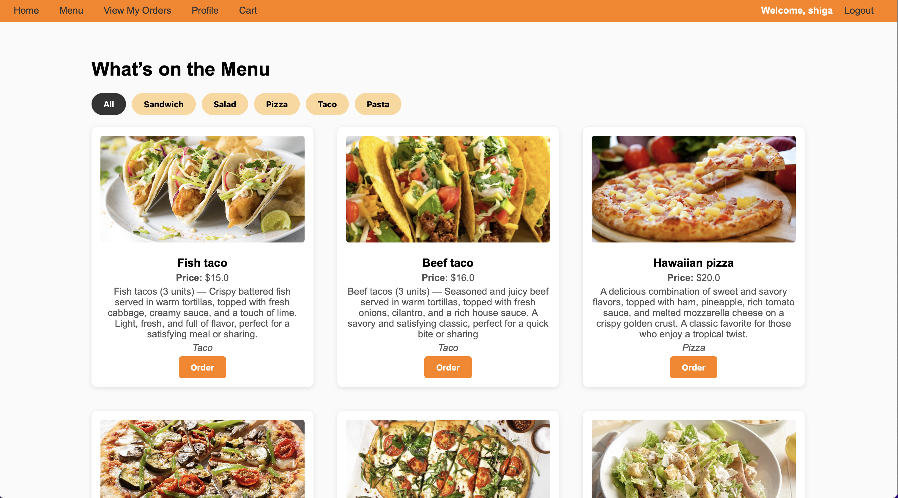
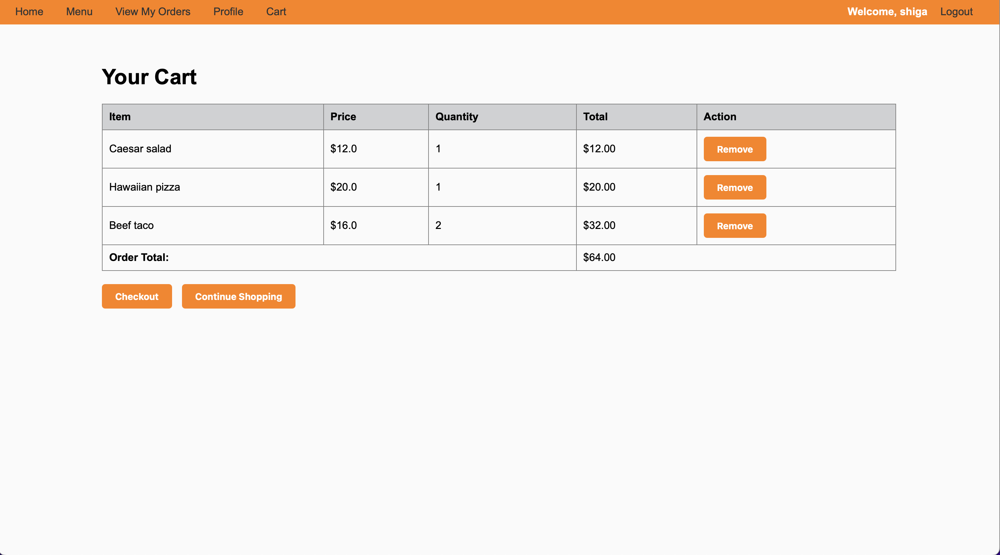
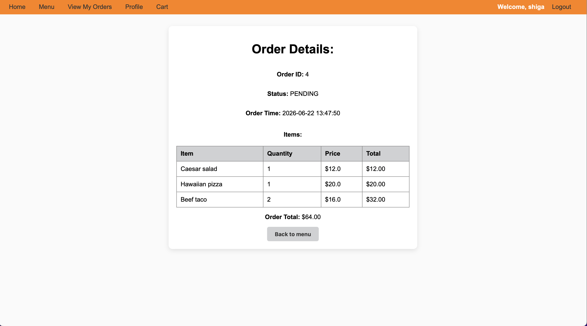
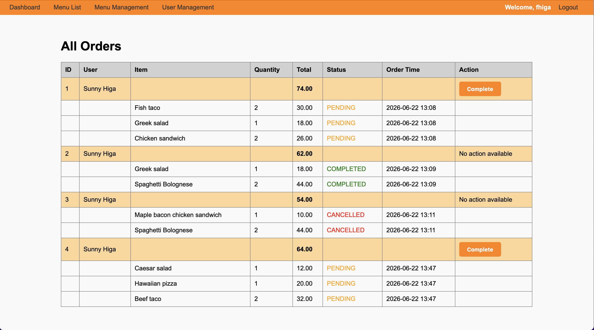

# SmartCafeteria

Spring Boot web application for a cafeteria/menu ordering project.

## Overview
- A Spring Boot (Java 21) application using Thymeleaf templates for server-side HTML.
- Data access via Spring Data JPA and MySQL.
- Basic Spring Security setup with custom login handling and password configuration.

## Features
**Customer Features:**
- **Browse Menu** — View available menu items with descriptions and pricing.


  
- **Shopping Cart** — Add/remove items from cart, adjust quantities before checkout.
  


- **Place Orders** — Complete order submission with order confirmation page.



- **Order History** — View past orders and their status in "My Orders".
- **User Profile** — Manage account information and view profile details.

**Admin Features:**
- **Admin Dashboard** — Central hub for admin operations.


  
- **Manage Menu Items** — Add, edit, delete menu items (with pricing and descriptions).
- **User Management** — View and update user accounts.
- **Order Tracking** — Monitor all orders placed through the system.

## Project structure (key folders)
- `src/main/java/com/example/smartcafeteria/controller` — MVC controllers (Auth, Menu, Cart, Order, Admin, User).
- `src/main/java/com/example/smartcafeteria/service` — Business logic and service layer.
- `src/main/java/com/example/smartcafeteria/repository` — Spring Data JPA repositories.
- `src/main/java/com/example/smartcafeteria/model` — JPA entities: `User`, `MenuItem`, `Order`, `OrderItem`, `Cart`.
- `src/main/java/com/example/smartcafeteria/security` — Security configuration (`SecurityConfig.java`, `PasswordConfig.java`).
- `src/main/resources/templates` — Thymeleaf HTML templates (e.g. `menu.html`, `cart.html`, `admin_*` pages).
- `src/main/resources/static` — Static assets (`style.css`, `script.js`).
- `uploads/` — Local uploads folder used by the app (images, etc.).

## Requirements
- Java 21
- Maven
- MySQL

## Configuration
- Default DB connection is in `src/main/resources/application.properties`:

```properties
spring.datasource.url=jdbc:mysql://localhost:3306/smartcafeteria
spring.datasource.username=root
spring.datasource.password=
spring.jpa.hibernate.ddl-auto=update
```

## Build & run
- Build the project (from repo root):

```bash
./mvnw clean package
```

- Run with the Maven Spring Boot plugin (dev-friendly):

```bash
./mvnw spring-boot:run
```

- Or run the produced jar:

```bash
java -jar target/smartcafeteria-0.0.1-SNAPSHOT.jar
```
